<div align="center">

<h1>🔍 Real-Time Person / Object Detector</h1>
<h3>Hardware-Accelerated CNN on Xilinx Zynq-7020 FPGA</h3>

<p>
  
  
  
  
</p>

<p>
  
  
  
  
  
  
  
</p>

<br/>

> A **3-layer hardware-accelerated CNN** deployed on the Zynq-7020 SoC, detecting **Person vs Object** in 64×64 grayscale images.  
> Built from scratch using Vitis HLS — **no Vitis AI, no FINN.**

</div>

---

## 📋 Table of Contents

- [Problem Statement](#-problem-statement)
- [Overview](#-overview)
- [Hardware Platform](#-hardware-platform)
- [CNN Architecture](#-cnn-architecture)
- [System Architecture](#-system-architecture)
- [HLS Accelerator](#-hls-accelerator)
- [AXI Register Map](#-axi-register-map)
- [Weight Layout](#-weight-layout)
- [Repository Structure](#-repository-structure)
- [Build & Deploy](#-build--deploy)
- [Python Driver](#-python-driver)
- [Output Format](#-output-format)
- [C Simulation Testbench](#-c-simulation-testbench)
- [Performance](#-performance)
- [Resource Utilization](#-resource-utilization)
- [Limitations](#-limitations)
- [Future Work](#-future-work)
- [Contributors](#-contributors)

---

## 🎯 Problem Statement

> **Real-Time Object Detection Using Hardware-Accelerated CNN on Xilinx Zynq FPGA with Arm Processor**

Design and implement a hardware-accelerated CNN inference system on a Xilinx Zynq SoC, leveraging FPGA fabric to achieve real-time object detection, and **quantitatively demonstrate performance improvements** over a CPU-only implementation.

The system partitions functionality between the Arm core and FPGA:
- The **Arm core** handles image capture, preprocessing, control logic, and post-processing
- The **FPGA fabric** accelerates compute-intensive CNN operations (convolution, ReLU, pooling) using Vitis HLS

**Performance Targets:** Real-time inference · Minimum 2× speedup over software-only execution · Measurable improvements in latency, throughput, and power efficiency

---

## 🧠 Overview

This project implements a complete end-to-end CNN inference pipeline on the **PYNQ-Z2** FPGA board. The CNN is synthesized from C++ using **Vitis HLS**, integrated into a **Vivado block design**, and driven from Python using the **PYNQ framework**.

| Component | Role |
|-----------|------|
| ARM Cortex-A9 (PS) | Image preprocessing (CLAHE), weight loading, control, post-processing |
| FPGA Fabric (PL) | Conv layers, ReLU, pooling, FC — all parallelized in hardware |
| AXI-Lite | Control channel: start/done handshake + register addresses |
| AXI HP | High-performance data channel: image & weight DMA from DDR |

---

## 🖥️ Hardware Platform

| Component        | Details                            |
|------------------|------------------------------------|
| **Board**        | PYNQ-Z2                            |
| **SoC**          | Xilinx Zynq-7020 (XC7Z020CLG400)  |
| **CPU**          | Dual-core ARM Cortex-A9 @ 650 MHz |
| **BRAM**         | 140 × 36K blocks                   |
| **DSP Slices**   | 220 × DSP48E1                      |
| **Toolchain**    | Vivado 2023.1 + Vitis HLS 2023.1  |
| **Target Clock** | 10 ns (100 MHz)                    |
| **Target Part**  | `xc7z020clg400-1`                  |

---

## 🏗️ CNN Architecture

```
Input: 64×64 grayscale image
         │
    ┌────▼────┐
    │  Conv1  │  3×3, 8 filters   → 62×62×8
    │  ReLU   │
    │  Pool1  │  2×2 max          → 31×31×8
    ├────▼────┤
    │  Conv2  │  3×3, 16 filters  → 29×29×16
    │  ReLU   │
    │  Pool2  │  2×2 max          → 14×14×16
    ├────▼────┤
    │  Conv3  │  3×3, 32 filters  → 12×12×32
    │  ReLU   │
    │  Pool3  │  2×2 max          →  6×6×32
    ├────▼────┤
    │   FC    │  1152 → 64        → 64
    │  ReLU   │
    ├────▼────┤
    │  Out    │  Argmax           → 2 classes
    └─────────┘
         │
   Person / Object
```

### Layer Summary

| Layer  | Input Shape  | Output Shape | Parameters               |
|--------|--------------|--------------|--------------------------|
| Conv1  | 64×64×1      | 62×62×8      | 8 filters, 3×3           |
| Pool1  | 62×62×8      | 31×31×8      | 2×2 max pooling          |
| Conv2  | 31×31×8      | 29×29×16     | 16 filters, 3×3, 8 ch   |
| Pool2  | 29×29×16     | 14×14×16     | 2×2 max pooling          |
| Conv3  | 14×14×16     | 12×12×32     | 32 filters, 3×3, 16 ch  |
| Pool3  | 12×12×32     | 6×6×32       | 2×2 max pooling          |
| FC     | 1152         | 64           | 64 neurons               |
| Output | 64           | 2            | Argmax (Person/Object)   |

**Precision:** INT8 weights and activations, INT16/INT32 accumulators  
**Total weights:** 79,560 · **Total biases:** 120


---

## 🔧 System Architecture


### AXI Interface Summary

| Interface   | Bundle    | Purpose                              |
|-------------|-----------|--------------------------------------|
| `m_axi`     | `gmem0`   | Image read + Result write (DDR)      |
| `m_axi`     | `gmem1`   | All weights and bias read (DDR)      |
| `s_axilite` | `control` | Port addresses, start/done, return   |

---

## ⚡ HLS Accelerator

The accelerator (`real_detector.cpp`) implements all CNN layers in a **single HLS kernel** with hand-optimized pragmas for maximum throughput.

### Key HLS Pragmas

```cpp
// Pipelined convolution inner loops — II=1 means one output per clock
#pragma HLS PIPELINE II=1

// BRAM-backed feature map buffers (saves LUT-RAM)
#pragma HLS BIND_STORAGE variable=conv1 type=RAM_2P impl=BRAM
#pragma HLS BIND_STORAGE variable=pool1 type=RAM_2P impl=BRAM

// Full unroll for small arrays (FC output, class scores)
#pragma HLS ARRAY_PARTITION variable=fc complete
#pragma HLS ARRAY_PARTITION variable=scores complete
```

### Convolution with ReLU (INT8 → INT16)

```cpp
ap_int<32> sum = 0;
for(int ky = 0; ky < 3; ky++)
    for(int kx = 0; kx < 3; kx++)
        sum += pixel * weight;   // INT8 × INT8 accumulated into INT32

sum += bias;
if(sum < 0) sum = 0;             // ReLU
output = (ap_int<16>)(sum >> 4); // Scale down + truncate to INT16
```

### Bounding Box via Activation Hotspot

Pool3 (6×6×32) is scanned to find the spatial coordinate with maximum summed activation. That coordinate maps back to the 64×64 image space:

```cpp
best_x = x * 10 + 5;  // 6×6 → 64×64 coordinate mapping
best_y = y * 10 + 5;
```

---

## 📌 AXI Register Map

| Offset  | Register           | Description                             |
|---------|--------------------|-----------------------------------------|
| `0x00`  | `CTRL`             | `AP_START` (bit 0) / `AP_DONE` (bit 1) |
| `0x10`  | `image` addr low   | Image DDR physical address              |
| `0x14`  | `image` addr high  | Image DDR physical address              |
| `0x1C`  | `conv1_w` addr     | Conv1 weights DDR address               |
| `0x24`  | `conv1_b` addr     | Conv1 bias DDR address                  |
| `0x2C`  | `conv2_w` addr     | Conv2 weights DDR address               |
| `0x34`  | `conv2_b` addr     | Conv2 bias DDR address                  |
| `0x3C`  | `conv3_w` addr     | Conv3 weights DDR address               |
| `0x44`  | `conv3_b` addr     | Conv3 bias DDR address                  |
| `0x4C`  | `fc_w` addr        | FC weights DDR address                  |
| `0x54`  | `fc_b` addr        | FC bias DDR address                     |
| `0x5C`  | `result` addr      | Result buffer DDR address               |

---

## ⚖️ Weight Layout

Weights are stored as separate INT8 arrays, each independently allocated via `pynq.allocate()` and passed as individual AXI Master ports.

| Symbol      | Size (bytes) | Formula            |
|-------------|--------------|--------------------|
| `CONV1_W`   | 72           | 8 × 1 × 9         |
| `CONV1_B`   | 8            | 8                  |
| `CONV2_W`   | 1,152        | 16 × 8 × 9        |
| `CONV2_B`   | 16           | 16                 |
| `CONV3_W`   | 4,608        | 32 × 16 × 9       |
| `CONV3_B`   | 32           | 32                 |
| `FC_W`      | 73,728       | 64 × 6 × 6 × 32   |
| `FC_B`      | 64           | 64                 |
| **Total W** | **79,560**   |                    |
| **Total B** | **120**      |                    |

---

## 📁 Repository Structure

> Reflects the actual layout of this repository.

```
CNN-Accelerator/
│
├── Hls_files/                    # Vitis HLS source & synthesis scripts
│   ├── real_detector.cpp         #   HLS CNN kernel (Conv1/2/3 + FC + Argmax)
│   ├── real_detector.h           #   Port declarations + weight size macros
│   ├── real_detector_test.cpp    #   C simulation testbench (2 test cases)
│   └── run_real_detect.tcl       #   HLS synthesis + C-sim + IP export script
│
├── PYNQ_overlay/                 # FPGA deployment files
│   ├── overlay.bit               #   FPGA bitstream
│   ├── overlay.hwh               #   Hardware handoff (PYNQ register map)
│   └── python_driver.py          #   Python inference driver
│
├── Vivado/                       # Vivado block design project
│   └── real_detect.xpr
│
├── Weights/                      # Trained INT8 weight arrays (.npy)
│   ├── conv1_w.npy / conv1_b.npy
│   ├── conv2_w.npy / conv2_b.npy
│   ├── conv3_w.npy / conv3_b.npy
│   └── fc_w.npy    / fc_b.npy
│
├── dataset/
│   └── sample_images/            # Sample test images (64×64 grayscale)
│
├── demo/
│   └── images/                   # Demo output screenshots & BBox overlays
│
├── docs/                         # Design documentation
│   ├── system_architecture.md
│   └── results.md
│
├── results/                      # Benchmark results & utilization reports
│
└── README.md
```


---

## 🚀 Build & Deploy

### Step 1 — HLS Synthesis

```bash
source /Xilinx/Vitis_HLS/2023.1/settings64.sh
cd Hls_files/
vitis_hls run_real_detect.tcl
```

`run_real_detect.tcl` will automatically:
1. Run C simulation (`csim_design -clean`) — validates both test cases
2. Run synthesis (`csynth_design`) — generates RTL + timing/resource report
3. Export IP catalog — ready for Vivado import

Synthesis report location:
```
real_detector_hls/solution1/syn/report/real_detector_csynth.rpt
```

### Step 2 — Vivado Block Design

```bash
vivado Vivado/real_detect.xpr
```

1. Import HLS IP from `real_detector_hls/solution1/impl/ip`
2. Add **Zynq PS** block → Run Block Automation
3. Connect `M_AXI_GP0` → AXI Interconnect → `s_axilite` (control)
4. Connect `S_AXI_HP0` → AXI Interconnect → `m_axi_gmem0`, `m_axi_gmem1`
5. Enable DDR and GP/HP ports in Zynq PS configuration
6. Run **Generate Bitstream**

### Step 3 — Deploy to PYNQ-Z2

```bash
scp PYNQ_overlay/overlay.bit      xilinx@<board-ip>:~/
scp PYNQ_overlay/overlay.hwh      xilinx@<board-ip>:~/
scp PYNQ_overlay/python_driver.py xilinx@<board-ip>:~/
scp -r Weights/                   xilinx@<board-ip>:~/
```

### Step 4 — Run Inference

```bash
python3 python_driver.py
```

---

## 🐍 Python Driver

```python
from pynq import Overlay, allocate
import numpy as np

ol  = Overlay("overlay.bit")
det = ol.real_detector_0

# Load weights
conv1_w = np.load("Weights/conv1_w.npy").astype(np.int8)
conv1_b = np.load("Weights/conv1_b.npy").astype(np.int8)
# ... repeat for conv2, conv3, fc

# Allocate DMA-mapped DDR buffers
img_buf = allocate(shape=(4096,), dtype=np.uint8)
c1w_buf = allocate(shape=(72,),   dtype=np.int8)
c1b_buf = allocate(shape=(8,),    dtype=np.int8)
# ... repeat for all weight / result buffers
res_buf = allocate(shape=(9,),    dtype=np.int32)

# Copy weights into DDR
c1w_buf[:] = conv1_w
c1b_buf[:] = conv1_b

# Write physical DDR addresses into AXI-Lite registers
det.write(0x10, img_buf.physical_address & 0xFFFFFFFF)
det.write(0x14, img_buf.physical_address >> 32)
det.write(0x1C, c1w_buf.physical_address & 0xFFFFFFFF)
# ... all weight / result addresses

# Trigger accelerator and poll done
import time
det.write(0x00, 1)
t0 = time.time()
while not (det.read(0x00) & 0x2):
    pass
print(f"Latency: {(time.time()-t0)*1000:.2f} ms")

# Decode result
label = "Person" if res_buf[0] == 1 else "Object"
print(f"Class:      {label}")
print(f"BBox:       ({res_buf[1]}, {res_buf[2]}, {res_buf[3]}, {res_buf[4]})")
print(f"Confidence: {res_buf[5]}")
assert res_buf[8] == 0xC0FFEE00, "Magic mismatch — accelerator may not have completed"
```

---

## 📤 Output Format

The accelerator writes **9 × INT32** values to the result DDR buffer:

| Index  | Value         | Description                        |
|--------|---------------|------------------------------------|
| `[0]`  | `0` or `1`    | Class: 0 = Object, 1 = Person      |
| `[1]`  | `0–63`        | BBox X center (image coordinates)  |
| `[2]`  | `0–63`        | BBox Y center (image coordinates)  |
| `[3]`  | int           | BBox width                         |
| `[4]`  | int           | BBox height                        |
| `[5]`  | int           | Confidence (max pool3 activation)  |
| `[6]`  | int           | Raw Object class score             |
| `[7]`  | int           | Raw Person class score             |
| `[8]`  | `0xC0FFEE00`  | Magic number (completion check)    |

---

## 🧪 C Simulation Testbench

`real_detector_test.cpp` validates two synthetic input patterns with random INT8 weights:

| Test | Input Pattern                         | Pass Criterion              |
|------|---------------------------------------|-----------------------------|
| 1    | Vertical blob (x∈[20,40], y∈[10,55]) | `result[8] == 0xC0FFEE00`  |
| 2    | Square blob (x∈[15,50], y∈[20,45])   | `result[8] == 0xC0FFEE00`  |

The magic number `0xC0FFEE00` at `result[8]` confirms the accelerator completed all layers and wrote output correctly.

```bash
vitis_hls run_real_detect.tcl   # csim_design runs automatically
```

---

## 📊 Performance

> FPGA latency measured from `AP_START → AP_DONE` polling. CPU baseline measured via NumPy forward pass on the ARM core.

| Metric           | CPU Only (NumPy)  | FPGA Accelerated   | Notes                             |
|------------------|-------------------|--------------------|-----------------------------------|
| Latency (ms)     | **14.3 ms**       | **150 ms**         | CPU faster per-frame              |
| Throughput (FPS) | **69.8 FPS**      | **6.7 FPS**        | DDR weight fetch is bottleneck    |
| Power (W)        | ~5–6 W (PS only)  | ~2.5–3 W (PS+PL)   | **FPGA ~2× more power-efficient** |

```mermaid
xychart-beta
    title "Latency Comparison (ms) — lower is better"
    x-axis ["CPU (NumPy)", "FPGA Accelerated"]
    y-axis "Latency (ms)" 0 --> 160
    bar [14.3, 150]
```



> **Analysis:**
> - FPGA is **slower per-frame** due to DDR weight-fetch overhead on every inference call
> - FPGA is significantly more **power-efficient** (~2×) and produces **deterministic, fixed latency**
> - FPGA gave **correct classification in edge cases** where the CPU NumPy implementation misclassified
> - Primary optimization target: move weights to **BRAM-resident storage** to eliminate the DDR bottleneck

---

## 📐 Resource Utilization

> Source: `real_detect_wrapper_utilization_placed.rpt`

| Resource     | Used       | Available | Utilization   |
|--------------|------------|-----------|---------------|
| LUT          | 15,864     | 53,200    | **29.8%**     |
| Flip-Flop    | 21,241     | 106,400   | **19.9%**     |
| BRAM (36K)   | 35         | 140       | **25.0%**     |
| BRAM (18K)   | 35         | 280       | **12.5%**     |
| Total BRAM   | 52.5 tiles | 140       | **37.5%**     |
| DSP48E1      | 220        | 220       | ⚠️ **100%**   |


> **Observations:**
> - ⚠️ **DSP usage is fully saturated (100%)** — expected due to parallel MAC operations across all conv layers
> - LUT and BRAM remain within safe margins — design fits comfortably on XC7Z020
> - Cannot add more filters or FC neurons without DSP optimization or resource sharing

---

## ⚠️ Limitations

- Fixed **64×64** input resolution — no dynamic resizing
- **Single-image** inference — no batching support
- **2-class** output only (Person / Object)
- Bounding box estimated from Pool3 **activation hotspot**, not a trained regression head
- DSP48E1 at **100% utilization** — no headroom to scale up without optimization
- No AXI-Stream pipeline — each inference requires a full start/done handshake

---

## 🔮 Future Work

- [ ] BRAM-resident weights to eliminate DDR access latency bottleneck
- [ ] AXI-Stream pipeline for continuous frame input
- [ ] Live camera feed integration (OV7670 / USB webcam)
- [ ] Trained bounding box regression head (replace activation hotspot)
- [ ] Pruning and sparsity for DSP resource reduction
- [ ] Quantization-aware training (QAT) for better INT8 accuracy
- [ ] Multi-class extension beyond Person / Object
- [ ] PetaLinux OS integration for production deployment

---

## 👥 Contributors

<table>
  <tr>
    <td align="center" width="33%">
      <b>Arunachalam P</b><br/>
      <sub>CNN HLS Design · Vivado Integration · PYNQ Driver</sub><br/><br/>
      <a href="https://github.com/Arunachalam-212223060022">
        
      </a><br/>
      <a href="https://linkedin.com/in/your-linkedin-here">
        
      </a>
    </td>
    <td align="center" width="33%">
      <b>Tharun Kumaran G</b><br/>
      <sub>Hardware Co-design · System Integration</sub><br/><br/>
      <a href="https://github.com/Tharun-kumaran-G">
        
      </a><br/>
      <a href="http://www.linkedin.com/in/tharun-kumaran-g">
        
      </a>
    </td>
    <td align="center" width="33%">
      <b>Divyashree G</b><br/>
      <sub>CNN Training · Performance Analysis</sub><br/><br/>
      <a href="https://github.com/divyashree-placeholder">
        
      </a><br/>
      <a href="https://linkedin.com/in/divyashree-placeholder">
        
      </a>
    </td>
  </tr>
</table>

> 📝 Replace the placeholder GitHub/LinkedIn URLs for **Arunachalam.P** and **Divyashree.G** with actual profile links before pushing.

---

## 🙏 Acknowledgements

[](https://www.xilinx.com/products/design-tools/vitis/vitis-hls.html)
[](https://www.xilinx.com/products/design-tools/vivado.html)
[](http://www.pynq.io/)
[](https://jupyter.org/)
[](https://numpy.org/)
[](https://opencv.org/)

---

<div align="center">
  <sub>⚡ Built on Zynq-7020 · Department of Electronics & Communication Engineering</sub>
</div>
