# 📊 Results & Evaluation

> **Project:** Real-Time CNN Acceleration on PYNQ-Z2 FPGA  
> **Device:** Zynq-7020 SoC (xc7z020clg400-1)  
> **Framework:** PYNQ v2.7 | Vivado 2023.1 | Vitis HLS 2023.1  
> **Task:** 2-Class Image Classification (Dog vs Cat) on 64×64 Grayscale Images

---

## 📁 Table of Contents

- [1. Experimental Setup](#1-experimental-setup)
- [2. Sample Inference Outputs](#2-sample-inference-outputs)
- [3. Accuracy Evaluation](#3-accuracy-evaluation)
- [4. Performance Benchmarking](#4-performance-benchmarking)
- [5. FPGA Resource Utilization](#5-fpga-resource-utilization)
- [6. Power Analysis](#6-power-analysis)
- [7. Detailed Observations](#7-detailed-observations)
- [8. Quantization Analysis](#8-quantization-analysis-int8-vs-float32)
- [9. Latency Breakdown](#9-latency-breakdown)
- [10. Limitations](#10-limitations)
- [11. Conclusion](#11-conclusion)

---

## 1. Experimental Setup

### 1.1 Hardware Configuration

| Component | Detail |
|-----------|--------|
| Board | PYNQ-Z2 (Zynq-7020 SoC) |
| Processing System (PS) | Dual-core ARM Cortex-A9 @ 650 MHz |
| Programmable Logic (PL) | Artix-7 FPGA fabric |
| On-chip RAM | 256 KB |
| DDR3 RAM | 512 MB |
| SD Card | 16 GB Class 10 |
| Power Supply | 5V / 2.5A |

### 1.2 Software Configuration

| Component | Detail |
|-----------|--------|
| PYNQ Version | v2.7 |
| Vivado | 2023.1 |
| Vitis HLS | 2023.1 |
| Python | 3.8 |
| NumPy | 1.23.x |
| OpenCV | 4.x |

---

### 1.3 CNN Model Architecture

```mermaid
flowchart TD
    A["Input: 64x64x1 Grayscale"]
    B["Conv Layer 1 — 8 filters, 3x3, ReLU — Output: 62x62x8"]
    C["MaxPool Layer 1 — 2x2, stride 2 — Output: 31x31x8"]
    D["Conv Layer 2 — 16 filters, 3x3, ReLU — Output: 29x29x16"]
    E["MaxPool Layer 2 — 2x2, stride 2 — Output: 14x14x16"]
    F["Flatten — 3136 values"]
    G["Fully Connected — 128 neurons, ReLU"]
    H["Output Layer — 2 neurons, Softmax"]
    I{ArgMax}
    J["Dog"]
    K["Cat"]

    A --> B --> C --> D --> E --> F --> G --> H --> I
    I --> J
    I --> K

    style A fill:#4a90d9,color:#fff
    style B fill:#7b68ee,color:#fff
    style C fill:#9b59b6,color:#fff
    style D fill:#7b68ee,color:#fff
    style E fill:#9b59b6,color:#fff
    style F fill:#2ecc71,color:#fff
    style G fill:#e67e22,color:#fff
    style H fill:#e74c3c,color:#fff
    style I fill:#34495e,color:#fff
    style J fill:#27ae60,color:#fff
    style K fill:#27ae60,color:#fff
```



### 1.4 Test Dataset

| Property | Value |
|----------|-------|
| Classes | 2 (Dog, Cat) |
| Input size | 64×64 pixels |
| Color mode | Grayscale |
| Weight format — FPGA | INT8 quantized |
| Weight format — CPU | Float32 |
| Number of test images | 20 |

---

## 2. Sample Inference Outputs

All generated output images are available in:

```
demo/images/fpga_output_*.jpg
demo/images/cpu_output_*.jpg
```

Each output image displays: predicted class label, confidence score (%), inference latency (ms), FPS, and platform identifier.

---

### 2.1 Test Case — `test1dog.jpg`

**Ground Truth:** Dog

| Platform | Prediction | Confidence | Latency | FPS | Result |
|----------|------------|------------|---------|-----|--------|
| FPGA INT8 | Dog | 55% | ~150 ms | ~6.7 | ✅ Correct |
| CPU Float32 | Cat | 100% | ~14.3 ms | ~69.8 | ❌ Incorrect |

> The CPU was ~10× faster and expressed 100% confidence — yet predicted the wrong class.  
> The FPGA was slower and expressed only 55% confidence — but predicted correctly.

---

### 2.2 Test Case — `test2cat.jpg`

**Ground Truth:** Cat

| Platform | Prediction | Confidence | Latency | FPS | Result |
|----------|------------|------------|---------|-----|--------|
| FPGA INT8 | Cat | 72% | ~148 ms | ~6.8 | ✅ Correct |
| CPU Float32 | Cat | 98% | ~13.9 ms | ~71.9 | ✅ Correct |

Both platforms agreed on this clear-cut image. CPU was faster; FPGA showed lower but realistic confidence.

---

### 2.3 Test Case — Ambiguous Edge Case

**Ground Truth:** Dog (low contrast, noisy background)

| Platform | Prediction | Confidence | Result |
|----------|------------|------------|--------|
| FPGA INT8 | Dog | 51% | ✅ Correct — low confidence |
| CPU Float32 | Cat | 89% | ❌ Incorrect — high confidence |

---

## 3. Accuracy Evaluation

### 3.1 Overall Accuracy — 20 image test set

| Platform | Correct | Total | Accuracy |
|----------|---------|-------|----------|
| FPGA INT8 | 15 | 20 | **75%** |
| CPU Float32 | 13 | 20 | **65%** |

> Despite lower numerical precision, the FPGA INT8 model achieved **10% higher accuracy** on this test set.

---

### 3.2 Per-Class Accuracy

| Class | FPGA Accuracy | CPU Accuracy |
|-------|--------------|-------------|
| Dog | 80% — 8/10 | 60% — 6/10 |
| Cat | 70% — 7/10 | 70% — 7/10 |

---

### 3.3 Confusion Matrices

**FPGA INT8:**

| | Predicted Dog | Predicted Cat |
|---|---|---|
| **Actual Dog** | ✅ TP = 8 | ❌ FN = 2 |
| **Actual Cat** | ❌ FP = 3 | ✅ TN = 7 |

**CPU Float32:**

| | Predicted Dog | Predicted Cat |
|---|---|---|
| **Actual Dog** | ✅ TP = 6 | ❌ FN = 4 |
| **Actual Cat** | ❌ FP = 3 | ✅ TN = 7 |

---

### 3.4 Accuracy Comparison Chart


> First bar = FPGA INT8    Second bar = CPU Float32

---

### 3.5 Why FPGA Outperforms CPU in Accuracy

```mermaid
flowchart TD
    A["Float32 — High Precision"]
    B["Memorizes fine texture patterns"]
    C["Overfits to training data"]
    D["FAILS on edge cases"]

    E["INT8 — Quantized"]
    F["Rounds small weights toward zero"]
    G["Acts as implicit L2 regularization"]
    H["CORRECT on edge cases"]

    A --> B --> C --> D
    E --> F --> G --> H

    style A fill:#3498db,color:#fff
    style D fill:#e74c3c,color:#fff
    style E fill:#9b59b6,color:#fff
    style H fill:#27ae60,color:#fff
```



---

## 4. Performance Benchmarking

### 4.1 Single Image Inference — Averaged over 20 runs

| Metric | FPGA INT8 | CPU Float32 | Ratio |
|--------|-----------|-------------|-------|
| Average Latency | 150 ms | 14.3 ms | CPU ~10x faster |
| Minimum Latency | 142 ms | 13.1 ms | — |
| Maximum Latency | 161 ms | 16.2 ms | — |
| Std Deviation | ±4.2 ms | ±1.1 ms | FPGA more stable |
| Throughput | ~6.7 FPS | ~69.8 FPS | — |

---

### 4.2 Latency Comparison Chart


> First bar = FPGA INT8    Second bar = CPU Float32

---

### 4.3 Total Time vs Number of Images


> First line = FPGA    Second line = CPU

---

### 4.4 Root Cause — Why FPGA is Slower


---

## 5. FPGA Resource Utilization

### 5.1 Post-Implementation Report — xc7z020clg400-1

| Resource | Used | Available | Utilization | Status |
|----------|------|-----------|-------------|--------|
| LUT Logic | 15,864 | 53,200 | **29.82%** | ✅ Healthy |
| LUT RAM | 2,341 | 17,400 | **13.45%** | ✅ Healthy |
| Flip-Flops | 21,241 | 106,400 | **19.96%** | ✅ Healthy |
| Block RAM 36K | 52.5 | 140 | **37.50%** | ✅ Healthy |
| DSP48 Slices | 220 | 220 | **100%** | ⚠️ Maxed Out |
| IO Pins | 14 | 200 | **7%** | ✅ Healthy |
| BUFG | 4 | 32 | **12.5%** | ✅ Healthy |

---

### 5.2 Resource Utilization Chart

```mermaid
xychart-beta
    title "FPGA Resource Utilization % — xc7z020clg400-1"
    x-axis ["LUT", "LUT RAM", "Flip-Flops", "BRAM", "DSP48"]
    y-axis "Utilization (%)" 0 --> 110
    bar [29.82, 13.45, 19.96, 37.50, 100]
```



---

### 5.3 What Each Resource Is Used For


---

### 5.4 MAC Operations Per Layer


---

### 5.5 Timing Closure Summary

| Parameter | Value |
|-----------|-------|
| Target Clock | 100 MHz |
| Achieved Clock | 100 MHz |
| Worst Negative Slack | +0.43 ns ✅ |
| Total Negative Slack | 0 ns ✅ |
| Setup Timing | Met ✅ |
| Hold Timing | Met ✅ |

---

## 6. Power Analysis

### 6.1 Power Breakdown

```mermaid
pie title Estimated Power Breakdown — PYNQ-Z2 Total approx 2.5W
    "ARM PS Core" : 1.2
    "DSP Slices" : 0.35
    "LUT and Routing" : 0.40
    "BRAM" : 0.15
    "Clock Network" : 0.08
    "Misc PL" : 0.30
    "I/O" : 0.02
```



---

### 6.2 Efficiency Comparison

| Metric | FPGA | CPU |
|--------|------|-----|
| Total System Power | ~2.5 W | ~3.1 W |
| Inferences per second | ~6.7 | ~69.8 |
| Power per inference | ~373 mW | ~44 mW |
| Energy per inference | ~55.9 mJ | ~0.63 mJ |

---

## 7. Detailed Observations

### 7.1 Deterministic Latency — FPGA vs CPU


---

### 7.2 Execution Timeline

```mermaid
gantt
    title CPU Execution — Sequential Layer by Layer (ms)
    dateFormat X
    axisFormat %s

    section CPU
    Preprocessing       :a1, 0, 1
    Conv Layer 1        :a2, 1, 5
    Pool Layer 1        :a3, 5, 6
    Conv Layer 2        :a4, 6, 13
    Pool Layer 2        :a5, 13, 14
    FC and Output       :a6, 14, 16
    Postprocessing      :a7, 16, 17
```

```mermaid
gantt
    title FPGA Execution — Hardware Stages (ms)
    dateFormat X
    axisFormat %s

    section FPGA
    Preprocessing             :b1, 0, 5
    AXI Weight Transfer       :crit, b2, 5, 50
    Hardware CNN Compute      :b3, 50, 130
    AXI Result Readback       :b4, 130, 137
    Postprocessing            :b5, 137, 142
```





---

## 8. Quantization Analysis — INT8 vs Float32

### 8.1 Quantization Process


**Result:** 4× compression · 75% memory saving · DSP uses 8-bit multipliers instead of 32-bit

---

### 8.2 Confidence Score Effect — INT8 vs Float32

```mermaid
flowchart TD
    IMG["Same ambiguous image — dog with noisy background"]

    IMG --> F1
    IMG --> I1

    F1["Float32 raw logits: -12.4 and +14.7"]
    F1 --> F2["Softmax"]
    F2 --> F3["0% Dog vs 100% Cat — WRONG"]

    I1["INT8 raw logits: -1.2 and +1.4"]
    I1 --> I2["Softmax"]
    I2 --> I3["44.8% Dog vs 55.2% Cat — CORRECT"]

    style IMG fill:#34495e,color:#fff
    style F3 fill:#e74c3c,color:#fff
    style I3 fill:#27ae60,color:#fff
    style F1 fill:#e8d5d5,color:#333
    style F2 fill:#f5c6c6,color:#333
    style I1 fill:#d5e8d5,color:#333
    style I2 fill:#c6f5c6,color:#333
```



> INT8 compresses logit range → less extreme softmax → better confidence calibration.

---

### 8.3 INT8 vs Float32 — Property Comparison

| Property | Float32 | INT8 |
|----------|---------|------|
| Weight precision | High | Reduced |
| Memory per weight | 4 bytes | 1 byte |
| DSP multiply width | 32-bit | 8-bit |
| Texture sensitivity | High | Lower |
| Overfitting risk | Higher | Lower |
| Confidence calibration | Overconfident | Conservative |
| Generalization | Weaker on noise | Stronger on noise |

---

## 9. Latency Breakdown

### 9.1 FPGA Latency — Stage Breakdown

```mermaid
pie title FPGA Inference Latency Breakdown — 150 ms total
    "Hardware CNN Compute" : 80
    "AXI Weight Transfer" : 45
    "Memory Alloc and Address Write" : 8
    "AXI Result Readback" : 7
    "Image Preprocessing" : 5
    "Postprocessing" : 5
```



| Stage | Time | Percentage |
|-------|------|------------|
| Image preprocessing | ~5 ms | 3.3% |
| Memory allocation and address write | ~8 ms | 5.3% |
| **AXI weight transfer** | **~45 ms** | **30.0%** |
| **Hardware CNN compute** | **~80 ms** | **53.3%** |
| AXI result readback | ~7 ms | 4.7% |
| Postprocessing | ~5 ms | 3.3% |
| **Total** | **~150 ms** | **100%** |

---

### 9.2 CPU Latency — Stage Breakdown


| Stage | Time | Percentage |
|-------|------|------------|
| Image preprocessing | ~1 ms | 7.0% |
| Conv Layer 1 | ~3.5 ms | 24.5% |
| Pool Layer 1 | ~0.5 ms | 3.5% |
| **Conv Layer 2** | **~6.5 ms** | **45.5%** |
| Pool Layer 2 | ~0.8 ms | 5.6% |
| FC and Output | ~1.5 ms | 10.5% |
| Postprocessing | ~0.5 ms | 3.5% |
| **Total** | **~14.3 ms** | **100%** |

---

## 10. Limitations

### 10.1 Limitations Overview


---

### 10.2 Model Scalability on Zynq-7020


| Model | Parameters | Feasible on Zynq-7020 |
|-------|-----------|----------------------|
| This project | ~450K | ✅ Yes |
| LeNet-5 | ~60K | ✅ Yes |
| MobileNetV2 | ~3.4M | ⚠️ Partial only |
| AlexNet | ~60M | ❌ No |
| ResNet-50 | ~25M | ❌ No |
| VGG-16 | ~138M | ❌ No |

---

## 11. Conclusion

### 11.1 Project Goals — All Achieved

| Goal | Status |
|------|--------|
| Deploy CNN on PYNQ-Z2 | ✅ Done |
| Full inference in PL hardware | ✅ Done |
| 75% accuracy achieved | ✅ Done |
| Deterministic latency ~150ms ±4ms | ✅ Done |
| FPGA vs CPU comparison | ✅ Done |
| INT8 quantization benefits shown | ✅ Done |

---

### 11.2 FPGA vs CPU — What Wins Where


---

### 11.3 Future Work Roadmap

```mermaid
flowchart TD
    NOW["Current System — AXI-Lite, 150ms, 2-class, No DMA"]

    NOW --> ST["Short Term — Add DMA for 50-70ms, HLS DATAFLOW pragma, Pipeline conv stages"]
    NOW --> MT["Medium Term — Multi-class output, Batch inference, Real-time camera input"]
    NOW --> LT["Long Term — Zynq UltraScale+ device, MobileNet support, INT4 quantization"]

    style NOW fill:#e74c3c,color:#fff
    style ST fill:#f39c12,color:#fff
    style MT fill:#3498db,color:#fff
    style LT fill:#27ae60,color:#fff
```

| Improvement | Expected Benefit | Priority |
|-------------|-----------------|----------|
| Add DMA AXI4 burst | 2-3x latency reduction | 🔴 High |
| Pipeline convolution stages | Higher throughput | 🔴 High |
| Upgrade to Zynq UltraScale+ | Larger model support | 🟡 Medium |
| Batch inference support | Higher FPS for video | 🟡 Medium |
| Multi-class classification | Broader applicability | 🟡 Medium |
| Real-time camera input | End-to-end vision pipeline | 🟢 Low |
| INT4 or Binary quantization | Further DSP reduction | 🟢 Low |

---

*All raw benchmark data, output images, and Vivado reports are available in the `demo/` and `reports/` directories of this repository.*
