# 🧠 System Architecture
## Real-Time CNN Acceleration on PYNQ-Z2

> **Platform:** PYNQ-Z2 · XC7Z020 · Vitis HLS 2023.1 · INT8 Quantized  
> **Architecture:** ARM–FPGA Hardware–Software Co-Design  
> **Target:** Embedded Real-Time CNN Image Classification

---

## Table of Contents

1. [Overview](#1-overview)
2. [High-Level Architecture](#2-high-level-architecture)
3. [Full System Data Flow](#3-full-system-data-flow)
4. [Phase-by-Phase Explanation](#4-phase-by-phase-explanation)
5. [AXI Interface Architecture](#5-axi-interface-architecture)
6. [CNN Accelerator Pipeline](#6-cnn-accelerator-pipeline)
7. [Memory Architecture](#7-memory-architecture)
8. [Hardware Block Design (Vivado)](#8-hardware-block-design-vivado)
9. [Resource Utilization](#9-resource-utilization)
10. [Performance Metrics](#10-performance-metrics)
11. [Hardware–Software Partitioning](#11-hardwaresoftware-partitioning-decision)
12. [Execution Timing Diagram](#12-execution-timing-diagram)
13. [Limitations](#13-limitations)
14. [Future Improvements](#14-future-improvements)
15. [Summary](#15-summary)

---

## 1. Overview

The system implements a **hardware–software co-design CNN inference accelerator** on the **PYNQ-Z2 (Zynq-7020 SoC)** platform. The Zynq SoC is uniquely suited to this kind of project because it integrates both a general-purpose dual-core ARM processor and a large FPGA fabric on a single chip, allowing tight coupling between the two without the latency and bandwidth penalties of a discrete PCIe-connected FPGA.

The architecture is built around three key subsystems:

- **ARM Cortex-A9 Processing System (PS)** — handles software control, image loading, preprocessing, memory allocation, and result display using Python and the PYNQ framework
- **FPGA Programmable Logic (PL)** — implements the custom CNN inference engine as a hardware IP core generated by Vitis HLS, executing convolution, pooling, and classification in parallel dedicated hardware
- **Shared DDR3 Memory** — acts as the unified data exchange medium between the ARM and FPGA, with PYNQ-managed physically contiguous buffers and explicit cache coherency control

The central motivation for this split is simple: convolution is massively parallel and compute-intensive — it is far better suited to dedicated hardware than to a general-purpose CPU. By offloading CNN inference entirely to the FPGA, the ARM is freed to handle control flow and I/O while the hardware does the heavy lifting. The measured result is a **6.6× speedup** over a pure ARM CPU baseline, at **6.7 fps** end-to-end throughput.


---

## 2. High-Level Architecture

The three domains of this system — Processing System, Shared Memory, and Programmable Logic — interact in a carefully defined order. The diagram below captures the communication paths and the direction of data flow between them.

```mermaid
graph TB
    subgraph PS ["🖥️ ARM Processing System (PS)"]
        A["ARM Cortex-A9
        Python · PYNQ · OpenCV
        Image Load · Preprocess · Display"]
    end

    subgraph MEM ["💾 Shared DDR3 Memory"]
        B["Image Buffer
        4,096 bytes · uint8"]
        C["Weight Buffers
        INT8 Quantized"]
        D["Result Buffer
        class_id · confidence"]
    end

    subgraph PL ["⚡ FPGA Programmable Logic (PL)"]
        E["CNN HLS Accelerator IP
        Conv → ReLU → Pool → FC → ArgMax
        Vitis HLS 2023.1"]
    end

    A -- "① AXI-Lite: ap_start, addr config" --> E
    A -- "② Write image + flush cache" --> MEM
    E -- "③ AXI4 burst read: image + weights" --> MEM
    E -- "④ AXI4 burst write: result" --> MEM
    MEM -- "⑤ cache invalidate + read result" --> A

    style PS fill:#1a3a5c,stroke:#4fc3f7,color:#e0f7fa
    style MEM fill:#1a3a1a,stroke:#81c784,color:#e8f5e9
    style PL fill:#3a1a1a,stroke:#ef9a9a,color:#fce4ec
```



The numbered arrows reveal the execution order. The ARM first writes image data into DDR (step ②), then tells the FPGA where to find it and signals it to start (step ①). The FPGA autonomously bursts the data in from DDR (step ③), runs the full CNN inference pipeline, and writes the prediction back to DDR (step ④). Finally, the ARM reads the result (step ⑤).

The key design insight here is that the **ARM processor never transfers image data to the FPGA directly**. All bulk data movement happens through shared DDR3 memory using the FPGA's own high-bandwidth AXI4 master interfaces. The AXI-Lite bus between ARM and FPGA is used only for lightweight control signals — start, status, and address configuration. This separation keeps the control bus fast and the data bus uncontested.

---

## 3. Full System Data Flow

The diagram below expands the high-level view into the actual execution steps and their exact function calls. It maps directly to the code in your repository and to the system flowchart diagram from the project report.

```mermaid
flowchart TD
    START([🟢 START]) --> SW_INIT

    subgraph SW_INIT ["📦 Phase 1 — SW Init"]
        A["Load Image
        Read from SD card / filesystem"]
        B["Preprocess Image
        BGR→Gray · Resize 64×64 · uint8 flatten"]
        A --> B
    end

    SW_INIT --> DDR_SETUP

    subgraph DDR_SETUP ["💾 Phase 2 — DDR Setup"]
        C["Write Image to DDR
        img_buf[:] = data · buf.flush()"]
        D["Write Addr to Registers
        ip.write(0x10, lo) · ip.write(0x14, hi)"]
        C --> D
    end

    DDR_SETUP --> HW_EXEC

    subgraph HW_EXEC ["⚡ Phase 3 — Hardware Execution"]
        E["Start Accelerator
        ip.write(0x00, 0x01) · ap_ctrl"]
        F["FPGA Reads Data
        AXI4 · m_axi_gmem0 burst read"]
        G["CNN Inference
        Conv1 → Conv2 → FC → ArgMax on PL"]
        H{"DONE?
        ip.read(0x00) & 0x02"}
        E --> F --> G --> H
        H -- "NO → poll again" --> H
    end

    H -- "ap_done = 1 → continue" --> SW_OUT

    subgraph SW_OUT ["📤 Phase 4 — SW Output"]
        I["Result → DDR
        m_axi_gmem1 burst write"]
        J["ARM Reads Result
        res_buf.invalidate() · class_id"]
        K["Display Output
        BBox · Confidence · FPS"]
        I --> J --> K
    end

    SW_OUT --> END([🔴 END])

    style START fill:#1b5e20,color:#fff,stroke:#388e3c
    style END fill:#b71c1c,color:#fff,stroke:#e53935
    style SW_INIT fill:#0d2137,stroke:#4fc3f7
    style DDR_SETUP fill:#0d2137,stroke:#81c784
    style HW_EXEC fill:#1a0d0d,stroke:#ef9a9a
    style SW_OUT fill:#0d2137,stroke:#ffd54f
```



Each coloured subgraph corresponds to one architectural phase. The DONE? diamond is the only feedback loop in the entire pipeline — the ARM spins in a busy-wait until the FPGA sets its `ap_done` bit. The result write (node I) is placed inside Phase 4 deliberately: the FPGA writes its result to DDR *before* asserting `ap_done`, so the moment the ARM exits the poll loop the valid result is already sitting in memory.

---

## 4. Phase-by-Phase Explanation

### Phase 1 — SW Init: Software Initialization

The ARM processor begins by loading a raw image from the SD card into Python memory. This image arrives in OpenCV's default BGR colour format and must be preprocessed before the FPGA hardware can consume it.

The preprocessing pipeline does three things in sequence:

**① Colour Conversion — BGR → Grayscale**
The CNN was trained on single-channel grayscale inputs. Converting from BGR to grayscale reduces the input tensor from 3 channels to 1, cutting input memory by 3× and eliminating any colour information the model was never trained to use. This is done via `cv2.cvtColor`.

**② Resize to 64×64**
The hardware accelerator has a hardcoded input shape of 64×64 pixels. The image is resized using bilinear interpolation. The 64×64 choice was made specifically to keep the total convolution MAC count low enough to fit within the FPGA's 220 available DSP slices.

**③ Flatten to uint8 array**
The 2D 64×64 pixel array is flattened into a 1D `uint8` byte buffer (4,096 bytes total). This flat layout is exactly what will be burst-written to DDR and subsequently burst-read by the FPGA's AXI4 master in a single contiguous transaction.

```python
import cv2
import numpy as np

img     = cv2.imread("input.jpg")
gray    = cv2.cvtColor(img, cv2.COLOR_BGR2GRAY)   # 3ch → 1ch grayscale
resized = cv2.resize(gray, (64, 64))               # → 64×64 pixels
flat    = resized.flatten().astype(np.uint8)       # → 4096-byte flat array
```

This phase runs entirely on the ARM CPU and takes approximately 10–25 ms depending on the original input image resolution.

---

### Phase 2 — DDR Setup: Memory Configuration

Before the FPGA can access any data, two things must happen: the image data must be physically committed to DDR3 memory, and the accelerator must be told the physical address where that data lives.

**Step 1 — Allocate a physically contiguous buffer and copy the image:**

```python
from pynq import allocate

img_buf      = allocate(shape=(4096,), dtype=np.uint8)
img_buf[:]   = flat          # Copy preprocessed image into DDR-backed buffer
img_buf.flush()              # Flush ARM L1/L2 cache lines → commit to DDR
```

The `allocate()` call uses Linux's Contiguous Memory Allocator (CMA) to reserve memory that is guaranteed to be physically contiguous — not just virtually contiguous. This is a hard requirement because the FPGA's AXI4 master performs a single linear burst read and operates entirely in physical address space. If the buffer were fragmented across non-contiguous physical pages, the FPGA would read garbage.

The `flush()` call is equally critical: without it, the bytes written to `img_buf` may still be sitting in the ARM's L1 or L2 cache and not yet committed to main DRAM. The FPGA has no visibility into the ARM cache, so it would read whatever stale data was last written to that DDR address — typically zeros or leftover data from a previous run.

**Step 2 — Write the physical DDR address into the accelerator's AXI-Lite registers:**

```python
addr = img_buf.physical_address
lo   = addr & 0xFFFFFFFF
hi   = addr >> 32

ip.write(0x10, lo)    # Low 32 bits of 40-bit physical address
ip.write(0x14, hi)    # High bits
```

The HLS-generated IP core exposes its input pointer argument as a memory-mapped AXI-Lite register pair at offsets `0x10` and `0x14`. The FPGA does not discover the DDR address autonomously — the ARM must configure it explicitly before every inference run. This is the design contract between the two halves of the system.

---

### Phase 3 — Hardware Execution: FPGA CNN Inference

This is the core acceleration phase. The ARM issues a single register write to trigger the FPGA, then waits while the hardware does all the work.

**Triggering the accelerator:**

```python
ip.write(0x00, 0x01)    # Write ap_start = 1 to the ap_ctrl register
```

Register `0x00` is the `ap_ctrl` register, an HLS standard. Writing `0x01` sets the `ap_start` bit, which causes the HLS-generated finite state machine inside the accelerator to begin its execution sequence. Once `ap_start` is set, the accelerator no longer needs the ARM to do anything — it drives the AXI4 bus entirely on its own.

**What happens inside the FPGA during those 150ms:**

The CNN accelerator's internal FSM proceeds through four hardware stages:

| Stage | What Happens | AXI Bus Used |
|-------|-------------|--------------|
| Data load | Burst-read 64×64 image from DDR via `m_axi_gmem0` | AXI4 HP0 port |
| Weight load | Burst-read INT8 weights and biases from DDR | AXI4 HP0 port |
| Inference | Execute Conv→ReLU→Pool×2→FC→ArgMax in DSP logic | Internal only |
| Result write | Burst-write class_id prediction back to DDR via `m_axi_gmem1` | AXI4 HP0 port |

All 220 DSP48E1 slices are active during the convolution phases, performing parallel multiply-accumulate operations on the INT8-quantized weights.

**The poll loop — ARM busy-waits for completion:**

```python
while not (ip.read(0x00) & 0x02):
    pass    # Spin until ap_done bit (bit 1) is set by the FPGA
```

The FPGA sets bit 1 (`ap_done`) of register `0x00` only after all inference results have been committed to DDR. The ARM reads this register repeatedly until `ap_done = 1`, then proceeds. This polling approach is simple and deterministic but wastes approximately one full ARM core for ~150 ms. A future improvement would wire `ap_done` to a PS interrupt line so the ARM can sleep during inference.

---

### Phase 4 — SW Output: Result Retrieval and Display

Once the poll loop exits, the FPGA has already written the inference result to the result buffer in DDR. However, the ARM cannot simply read from `res_buf` immediately — it must first invalidate its cache.

**Why cache invalidation is essential:**

The ARM's cache still holds whatever bytes were previously at the `res_buf` physical address — this might be zeros from allocation, or a prediction from a previous frame. The FPGA wrote new bytes to DDR, but those bytes have not propagated into the ARM's cache. Reading without invalidation would return the stale cached value, not the new FPGA result.

```python
res_buf.invalidate()              # Discard ARM cache lines → force re-read from DDR
class_id    = int(res_buf[0])     # Read the ArgMax output — predicted class index
confidence  = float(res_buf[1]) / 255.0   # Normalised confidence score (0.0–1.0)
```

After reading the result, the ARM draws the output overlay:

```python
label = f"Class: {class_id}  Conf: {confidence:.2f}  FPS: {fps:.1f}"
cv2.putText(frame, label, (10, 30), cv2.FONT_HERSHEY_SIMPLEX, 0.8, (0, 255, 0), 2)
cv2.rectangle(frame, bbox_top_left, bbox_bottom_right, (0, 255, 0), 2)
cv2.imshow("FPGA CNN Inference", frame)
```

The final output includes the predicted class label, confidence score, and the live FPS counter measured from total wall-clock frame time.

---

## 5. AXI Interface Architecture

The Zynq SoC provides several AXI ports with different performance characteristics. This design uses two of them in combination to cleanly separate low-bandwidth control traffic from high-bandwidth data traffic.


**Why two separate AXI interfaces?**

The General Purpose (GP0) port routes through the ARM's interconnect fabric and is designed for low-latency register-style access. It is 32-bit wide and offers around 600 MB/s — more than sufficient for sending a few 4-byte control words, but far too slow for bulk image transfer. It connects to the HLS IP's AXI-Lite slave interface.

The High Performance (HP0) port bypasses the ARM CPU entirely and connects directly to the DDR controller via a dedicated 64-bit path capable of ~1.2 GB/s sustained throughput. The FPGA's AXI4 master interfaces (`m_axi_gmem0` for reads, `m_axi_gmem1` for writes) connect through this port. Crucially, the ARM never touches this path during inference — the FPGA drives it autonomously.

The complete AXI-Lite register map exposed by the HLS-generated control interface:

| Offset | Register | Direction | Description |
|--------|----------|-----------|-------------|
| `0x00` | `ap_ctrl` | R/W | Bit 0: `ap_start` · Bit 1: `ap_done` · Bit 2: `ap_idle` |
| `0x04` | `ap_gie` | W | Global interrupt enable (unused here) |
| `0x08` | `ap_ier` | W | Interrupt enable register (unused) |
| `0x0C` | `ap_isr` | R | Interrupt status register (unused) |
| `0x10` | `input_addr_lo` | W | Low 32 bits of image DDR physical address |
| `0x14` | `input_addr_hi` | W | High bits of image DDR address |
| `0x18` | `output_addr_lo` | W | Low 32 bits of result DDR address |
| `0x1C` | `output_addr_hi` | W | High bits of result DDR address |

---

## 6. CNN Accelerator Pipeline

The CNN architecture was deliberately kept small to fit within the Zynq-7020's resource budget while still achieving meaningful classification accuracy. It uses two convolutional blocks to extract hierarchical features, followed by a fully connected classifier.

```mermaid
flowchart LR
    IN["📥 Input
    64×64 × 1ch
    UINT8 pixels"] --> C1

    subgraph B1 ["Conv Block 1"]
        C1["Conv2D
        3×3 kernel · 8 filters
        stride=1 · same padding"]
        R1["ReLU
        max(0, x)"]
        P1["MaxPool 2×2
        stride=2
        Out: 32×32×8"]
        C1 --> R1 --> P1
    end

    P1 --> C2

    subgraph B2 ["Conv Block 2"]
        C2["Conv2D
        3×3 kernel · 16 filters
        stride=1 · same padding"]
        R2["ReLU
        max(0, x)"]
        P2["MaxPool 2×2
        stride=2
        Out: 16×16×16"]
        C2 --> R2 --> P2
    end

    P2 --> FL

    subgraph CL ["Classifier"]
        FL["Flatten
        16×16×16 = 4,096 values"]
        FC["Fully Connected
        4096 → N classes"]
        AM["ArgMax
        → class index"]
        FL --> FC --> AM
    end

    AM --> OUT["📤 Output
    class_id
    INT8"]

    style IN fill:#1a3a5c,stroke:#4fc3f7,color:#e0f7fa
    style OUT fill:#1b5e20,stroke:#388e3c,color:#e8f5e9
    style B1 fill:#2a1a3a,stroke:#ce93d8
    style B2 fill:#2a1a3a,stroke:#ce93d8
    style CL fill:#3a2a0a,stroke:#ffcc02
```



**Conv Block 1 — Low-Level Feature Extraction**

The first convolution layer applies 8 filters of size 3×3 across the single-channel 64×64 input. Each filter learns a different low-level feature such as edges, corners, or gradients. The output is a 64×64×8 feature map — 8 different spatial feature responses for every pixel location. ReLU introduces non-linearity by zeroing all negative activations. MaxPooling with a 2×2 window halves the spatial resolution to 32×32, discarding the weakest activations and reducing computation for subsequent layers by 4×. This layer requires 8 × 3 × 3 × 1 = **72 MAC operations per output pixel**.

**Conv Block 2 — Higher-Level Feature Composition**

The second convolution layer takes the 32×32×8 feature maps and applies 16 filters, learning composite patterns from combinations of Block 1's outputs. The spatial resolution halves again to 16×16 after pooling. This layer requires 16 × 3 × 3 × 8 = **1,152 MAC operations per output pixel** — 16× more than Block 1 — and is the primary consumer of the FPGA's DSP48E1 slices.

**Fully Connected Classifier**

The 16×16×16 = 4,096 values are flattened into a 1D vector and passed through a dense linear layer projecting to N output classes. ArgMax selects the class with the highest activation as the final prediction.

### Numerical Precision Strategy

A central design decision is the use of INT8 quantization for weights instead of the FP32 format used during training. This has significant consequences throughout the hardware pipeline.

```mermaid
flowchart LR
    W["Weights
    INT8 · 8-bit
    −128 to +127"]
    A["Input Activations
    UINT8 · 8-bit
    0 to 255"]
    MAC["DSP48E1
    18×27-bit multiplier
    48-bit accumulator
    INT8×INT8 → INT32 sum"]
    SCALE["Re-quantise
    INT32 → INT8
    scale factor applied"]
    OUT2["Next Layer
    Input: INT8"]

    W --> MAC
    A --> MAC
    MAC --> SCALE --> OUT2

    style W fill:#3a1a1a,stroke:#ef9a9a
    style A fill:#1a3a5c,stroke:#4fc3f7
    style MAC fill:#2a2a0a,stroke:#ffcc02
    style OUT2 fill:#1b5e20,stroke:#388e3c
```



| Stage | Precision | Bit Width | Rationale |
|-------|-----------|-----------|-----------|
| Input pixels | UINT8 | 8-bit | Grayscale pixel range 0–255 |
| Stored weights | INT8 | 8-bit | 4× smaller than FP32; maps to DSP48 input width |
| Stored biases | INT8 | 8-bit | Quantised during post-training quantisation |
| Post-multiply | INT16 | 16-bit | INT8 × INT8 product can reach 16 bits |
| Accumulation | INT32 | 32-bit | Sum of many INT16 values requires 32-bit headroom |
| Post-activation | INT8 | 8-bit | Re-quantised before passing to next layer |

INT8 quantization was chosen specifically because Xilinx DSP48E1 slices have 18×27-bit multipliers. INT8 operands fit comfortably within both input widths and allow the DSP cascade to run without bit-width overflow. FP32 multiplication would require multi-DSP floating-point wrappers or LUT-based soft logic that consumes far more area and runs slower.

> The INT8 weight scale factor is computed during post-training quantization to minimize the accuracy delta versus FP32. In practice, INT8 quantized models typically lose less than 1% classification accuracy compared to FP32 on standard benchmarks.

---

## 7. Memory Architecture

Shared DDR3 memory is the backbone of PS–PL communication in this system. The Zynq-7020 on the PYNQ-Z2 board has 512 MB of DDR3 SDRAM accessible to both the ARM through its native memory controller and to the FPGA through the high-performance AXI HP ports.


**Why physically contiguous buffers are required:**

The FPGA's AXI4 master performs a single burst transaction — it issues one start address and reads N consecutive bytes from that address forward. This works correctly only if those N bytes are physically contiguous in DRAM. Normal `numpy` arrays allocated via `malloc` are virtually contiguous but may span multiple non-contiguous physical memory pages. The FPGA, operating in physical address space, would skip across pages and read garbage. PYNQ's `allocate()` uses the Linux CMA subsystem to guarantee physical contiguity.

### Cache Coherency — The Hidden Complexity

One of the most important and often misunderstood aspects of ARM–FPGA shared memory is cache coherency. The ARM Cortex-A9 has L1 (32 KB) and L2 (512 KB) caches. When the ARM writes to a buffer, the bytes go into cache first and may not immediately reach DRAM. When the FPGA reads that physical DDR address, it bypasses the ARM cache entirely and reads whatever is actually in DRAM — which may be stale or empty.

The same problem exists in reverse: after the FPGA writes a result to DDR, the ARM's cache still holds old data from a previous read of that address. Reading through cache returns the stale value, not the FPGA's new result.

The solution is explicit cache management at well-defined synchronisation points:


| Coherency Step | PYNQ Call | Timing | Consequence if skipped |
|---------------|-----------|--------|----------------------|
| Cache writeback | `img_buf.flush()` | After ARM write, before FPGA read | FPGA reads zeros or old data |
| Cache invalidate | `res_buf.invalidate()` | After FPGA write, before ARM read | ARM reads stale prediction from cache |

Both errors are completely silent — no exception, no warning, just a wrong result. This is one of the most common bugs in PYNQ-based PS–PL designs.

---

## 8. Hardware Block Design (Vivado)

The Vivado block design wires together all hardware IP blocks inside the Zynq SoC. Understanding this block design is essential for anyone reproducing or modifying the system, as every connection here has a specific functional role.


**Clock domain:** The entire PL design runs at 50 MHz, generated by the PS's `FCLK_CLK0` output. At 50 MHz, one clock cycle is 20 ns. The 150 ms end-to-end FPGA inference time corresponds to approximately **7.5 million clock cycles**, most of which are spent executing convolution MAC chains through the DSP48E1 pipeline stages.

**Reset architecture:** The `proc_sys_reset_0` IP receives the raw active-low async reset from the PS and outputs synchronised reset signals aligned to the 50 MHz clock. Without proper reset synchronisation, flip-flops in the PL can enter metastable states at power-on, causing unpredictable behaviour on the first few inference runs.

**AXI Interconnect:** The `axi_interconnect_0` bridges the ARM's GP0 port (which uses full AXI protocol with the ARM's memory-mapped address space at offset `0x43C00000`) down to the HLS IP's simpler AXI-Lite slave. It handles address decoding and any protocol width mismatch.

**HLS IP Core generation:** The CNN accelerator IP was synthesised from annotated C++ source code by Vitis HLS. The HLS tool analyses the code's loop structure and memory access patterns, and automatically infers:
- An AXI-Lite slave interface from function pointer arguments (the `ap_ctrl` register map)
- An AXI4 master interface from arrays accessed via `INTERFACE pragma` directives
- DSP48E1 instantiation from multiply-accumulate loop bodies
- Pipeline registers from `PIPELINE` and `UNROLL` pragmas

---

## 9. Resource Utilization

The FPGA's programmable fabric contains a fixed number of each resource type. Understanding utilization reveals what headroom exists for future work and where the hard constraints lie.

| Resource | Used | Total Available | Utilization | Status |
|----------|------|----------------|-------------|--------|
| LUTs (Logic) | ~17,400 | 53,200 | ~33% | ✅ Comfortable |
| Flip-Flops | ~21,300 | 106,400 | ~20% | ✅ Comfortable |
| BRAM (36K equiv) | ~67 | 140 | ~48% | ✅ Acceptable |
| **DSP48E1 Slices** | **220** | **220** | **100%** | ⚠️ Fully saturated |
| IOB (I/O) | ~50 | 200 | ~25% | ✅ Fine |
| BUFG (Clocks) | 1 | 32 | 3% | ✅ Fine |

**Why DSP utilization hits exactly 100%:**

Each DSP48E1 slice on the Xilinx 7-series contains an 18×27-bit pre-multiplier and a 48-bit accumulator — precisely the building block for integer multiply-accumulate. Vitis HLS maps every inner-loop MAC operation in the convolution code to a dedicated DSP48 instance to achieve maximum throughput. With 8 filters in Conv1, 16 in Conv2, and a 3×3 kernel operating on multiple input channels, the total instantiated MAC units exactly fills all 220 available DSPs. This is not a coincidence — the network architecture was tuned to fit the hardware.

**Consequences of DSP saturation:**

Because DSPs are fully committed, adding even a few more convolutional filters would cause synthesis to overflow into LUT-based multiply logic, which is both slower (may fail timing at 50 MHz) and uses 4–8× more LUTs per multiplier. Any scaling of the network width requires either reducing numerical precision (INT4 instead of INT8 would halve DSP usage per multiplier) or moving to a larger FPGA such as the Zynq UltraScale+ with 1,728 DSP slices.

**BRAM usage** stores the weight and bias tables on-chip, eliminating repeated DDR reads during a single layer's computation. At 48% BRAM usage there is headroom for additional on-chip storage, which could be exploited to double-buffer weights for two layers simultaneously.

---

## 10. Performance Metrics

The system was benchmarked over 100 consecutive inference passes on a fixed test image set. All timing figures are wall-clock measurements from the Python host; FPGA-internal timing was estimated from synthesis reports.

| Metric | Value | Notes |
|--------|-------|-------|
| **FPGA Inference Latency** | **150 ms** | From `ap_start` to `ap_done` |
| **End-to-End FPS** | **6.7 fps** | Including preprocessing + display |
| **CPU Baseline Latency** | **14–21 ms per layer** | Pure ARM NumPy, no FPGA |
| **End-to-End Speedup** | **6.6×** | vs. full CPU pipeline |
| **AXI Burst Transfer Time** | ~20 ms | Image + weights read |
| **Preprocessing Time** | ~25 ms | BGR→Gray + Resize on ARM |
| **Clock Frequency** | 50 MHz | FCLK_CLK0 from PS |
| **Weight Precision** | INT8 | Post-training quantisation |
| **DSP Utilization** | 220 / 220 | 100% saturated |

### Latency Breakdown

The 150 ms FPGA inference time is dominated by Conv Block 2, which performs 16× more MAC operations per spatial position than Conv Block 1. The AXI burst transfers at the start and end add fixed overhead independent of network depth.

```mermaid
pie title FPGA Execution Time Budget — 150ms Total
    "AXI Burst Read (image + weights)" : 20
    "Conv Block 1 (3×3×8 filters)" : 30
    "Conv Block 2 (3×3×16 filters)" : 55
    "Fully Connected + ArgMax" : 25
    "AXI Burst Write (result)" : 15
    "FSM setup / handshake overhead" : 5
```



**Explaining the 6.6× speedup:**

The speedup comes from two sources: parallelism and elimination of Python overhead. On the ARM, each convolution must iterate over every output pixel sequentially in Python loops, and NumPy's vectorisation provides only partial relief. On the FPGA, all 220 DSP48 slices execute simultaneously on different portions of the filter bank, and there is zero Python interpreter overhead. The net result is that the FPGA completes Conv Block 2 in ~55 ms versus the ARM's ~140 ms for the equivalent computation.

Importantly, the **6.7 fps figure includes preprocessing and display time** (roughly 55 ms combined), which are not accelerated. Pure FPGA throughput would be ~6.7 fps if the ARM could keep up with image supply, but in practice the preprocessing pipeline is the second bottleneck after FPGA inference latency.

---

## 11. Hardware–Software Partitioning Decision

Deciding what runs on ARM and what runs on FPGA is the most important architectural decision in any heterogeneous SoC design. The wrong partition wastes resources; the right one maximises throughput.

The decision framework used here evaluates each pipeline stage against two axes:

- **Compute Intensity** — operations per input byte (how much work is done per data unit)
- **Data Parallelism** — how many independent operations can execute simultaneously

Tasks that score high on both axes are ideal FPGA candidates. Tasks that score low on both are better left on the flexible ARM.


**Key decisions explained:**

The **convolutional layers** sit firmly in the top-right FPGA quadrant. Each output feature map pixel requires hundreds of multiply-accumulates, and all output pixels are independent — perfect for spatial parallelism across DSP48 arrays.

**MaxPool and ReLU** are close to the FPGA boundary. They are low-compute (max/compare operations, not multiply) but highly parallel. In this design they are implemented in hardware as part of the HLS IP for simplicity — it would be wasteful to bring feature maps back to DDR just to apply a max operation on the ARM.

**Image load, grayscale conversion, and resize** are clearly ARM territory. They are fast (sub-25ms), inherently sequential, and require filesystem and OS access — things the FPGA cannot do.

**ArgMax** could theoretically be done on FPGA (it is inside the HLS core), but the computational cost is so low that the decision is irrelevant to overall performance.

The **boundary** was drawn such that everything from AXI burst read through AXI burst write runs in hardware. Everything else runs in Python on ARM.

---

## 12. Execution Timing Diagram

The Gantt chart below maps the actual wall-clock timeline of a single inference cycle across both the ARM and FPGA. This is the most important diagram for understanding system-level efficiency and identifying optimisation opportunities.


**Critical observations from this timeline:**

The red `Poll ap_done busy-wait` bar makes the main inefficiency immediately visible: the ARM is doing absolutely nothing useful for approximately **152 ms** out of a total 210 ms frame time. That is 72% of total frame time wasted spinning. This is a well-known limitation of software-polled accelerator control and is the primary target for optimisation.

The FPGA begins work almost instantly after `ap_start` (f1 starts at ms 41, one millisecond after a7 completes at ms 41). This confirms that the AXI-Lite control path latency is negligible — well under 1 ms from Python register write to first FPGA clock cycle of useful work.

Conv Block 2 (f4, 55 ms) takes nearly double the time of Conv Block 1 (f2, 35 ms) despite only doubling the filter count, because it also doubles the input channel count (1 → 8 after Block 1), resulting in 16 × 3 × 3 × 8 = 1,152 MACs per output pixel versus 8 × 3 × 3 × 1 = 72 MACs in Block 1.

**What double-buffering would change:**

If the ARM used an interrupt instead of busy-waiting, it could preload and preprocess the *next* frame during ms 41–193. The next `img_buf.flush()` and `ip.write` would complete before the FPGA finishes, meaning the next inference could start at ms 193 instead of ms 210 — a 17 ms saving per frame, roughly 10% throughput improvement with zero hardware changes.

---

## 13. Limitations

Understanding the limitations is as important as understanding the capabilities. Each constraint below has a specific root cause and a known mitigation path.

**DSP Saturation — 100% Utilization**

All 220 DSP48E1 slices on the XC7Z020 are consumed by the convolution MAC units. Adding even 4 more filters to Conv Block 2 would require 4 × 3 × 3 × 8 = 288 additional MAC operations, which cannot be mapped to DSPs and would instead spill into LUT-based logic that is slower and larger. The network cannot be scaled wider without either a larger FPGA or a reduction in weight precision.

**No Interrupt — Busy-Wait Polling**

The current design does not connect the FPGA's `ap_done` signal to a PS interrupt line. As a result, the ARM spends ~150 ms per frame executing a spin loop, consuming one full CPU core and preventing any concurrent work. Connecting `ap_done` to a GIC interrupt would free the ARM to preprocess the next frame.

**Memory-Mapped Transfer (No DMA Engine)**

The FPGA drives its own AXI4 transactions to DDR, which works correctly but means the ARM must initiate each inference via register write and wait for completion. A proper AXI DMA engine (e.g., Xilinx `axi_dma` IP) would support scatter-gather descriptor lists and hardware-managed buffer chaining, enabling true pipelined operation without ARM involvement between frames.

**Fixed 64×64 Input Resolution**

The hardware accelerator was synthesised with hardcoded loop bounds matching exactly 64×64 input. Changing input resolution requires re-running Vitis HLS synthesis, re-implementing in Vivado, and regenerating the FPGA bitstream — a process that takes 30–60 minutes. There is no runtime configurability.

**Single-Frame Pipeline**

The current architecture processes one image at a time with no internal frame buffering. Each frame goes through the full four-phase cycle sequentially. A ping-pong buffer design would allow the FPGA to process frame N while the ARM preprocesses frame N+1 simultaneously.

| Limitation | Root Cause | Mitigation |
|------------|-----------|------------|
| DSP 100% | Conv MAC parallelism fills all slices | INT4 weights or larger FPGA |
| Busy-wait ARM | No IRQ connected | Wire `ap_done` → GIC interrupt |
| Sequential pipeline | Single buffer design | Add ping-pong DDR buffers |
| Fixed resolution | Hardcoded HLS loop bounds | Parameterise + resynthesize |
| No batch inference | Single input path | Multi-channel AXI DMA |

---

## 14. Future Improvements

Improvements are grouped by implementation effort. Short-term changes require only software or minor HLS modifications. Long-term changes require FPGA redesign.

```mermaid
flowchart TD
    NOW["⚡ Current System
    150ms · 6.7fps · 6.6× speedup
    100% DSP · Busy-wait ARM"] --> S1

    subgraph SHORT ["🟢 Short Term — Software / Minor HLS Changes"]
        S1["① Add IRQ for ap_done
        Wire ap_done → PS GIC interrupt
        ARM sleeps during inference
        → Enables concurrent preprocessing"]
        S2["② Ping-pong Double Buffering
        Two img_buf allocations
        ARM writes buf[N+1] while
        FPGA reads buf[N]
        Est. gain: +10–15% FPS"]
        S1 --> S2
    end

    S2 --> M1

    subgraph MED ["🟡 Medium Term — HLS Redesign + New IP"]
        M1["③ Add Xilinx AXI DMA IP
        Replace memory-mapped burst
        with scatter-gather DMA
        Hardware buffer chaining
        Est. gain: +20% throughput"]
        M2["④ Winograd Convolution
        F(2×2, 3×3) reduces MACs by 2.25×
        Fit more filters within DSP budget
        → Wider network, better accuracy"]
        M3["⑤ Live Camera Input
        Replace SD card with MIPI CSI-2
        or HDMI input via Video DMA
        True real-time inference"]
        M1 --> M2 --> M3
    end

    M3 --> L1

    subgraph LONG ["🔴 Long Term — Architecture Redesign"]
        L1["⑥ INT4 Weight Quantization
        Halve DSP usage per multiplier
        Double available parallelism
        Requires QAT retraining"]
        L2["⑦ Systolic Array MAC Architecture
        Weight-stationary 2D MAC array
        Proper dataflow for conv layers
        Replaces ad-hoc HLS loop unrolling"]
        L3["⑧ Multi-Class Object Detection
        Add bounding box regression head
        NMS in hardware post-processing
        Output: class + coords + confidence"]
        L1 --> L2 --> L3
    end

    L3 --> TARGET["🎯 Target
    <50ms · 20fps · ~20× speedup"]

    style NOW fill:#3a1a1a,stroke:#ef9a9a,color:#fce4ec
    style SHORT fill:#1b3a1b,stroke:#81c784,color:#e8f5e9
    style MED fill:#3a3a0a,stroke:#ffcc02,color:#fff9c4
    style LONG fill:#1a1a3a,stroke:#90caf9,color:#e3f2fd
    style TARGET fill:#1b5e20,stroke:#388e3c,color:#e8f5e9
```



**Most impactful short-term change — IRQ + double buffering:**

By wiring `ap_done` to a PS interrupt and allocating two image buffers, the system can overlap ARM preprocessing of frame N+1 with FPGA inference of frame N. This requires zero changes to the Vivado block design, only a small HLS interrupt enable register write and a Python threading change. Estimated throughput improvement: 1.4–1.8× FPS with a few hours of implementation effort.

**Most impactful long-term change — Winograd convolution:**

The Winograd F(2×2, 3×3) algorithm reduces the number of multiplications in a 3×3 convolution from 9 to 4 per output element (with a corresponding increase in additions, which are cheap on LUTs). Since DSP48 slices are the binding constraint at 100% utilization, reducing multiply count by 2.25× allows the network to have 2.25× more filters before hitting the ceiling. A Conv Block 2 with 36 filters instead of 16 would significantly improve classification accuracy while staying within the same DSP budget.

**INT4 quantization:** Moving from INT8 to INT4 weights would halve the number of DSP48 slices needed per multiplier (two INT4 multiplications can be packed into one DSP48 using bit-width tricks), doubling the effective parallel MAC capacity. This requires quantization-aware retraining to maintain accuracy, but is a well-established technique with open-source tooling support.

---

## 15. Summary

This document describes a complete **ARM–FPGA co-designed CNN inference accelerator** deployed on the PYNQ-Z2 (Zynq-7020) platform. The system demonstrates a practical, end-to-end embedded AI inference pipeline that runs from a raw image file on SD card to an on-screen classification result in approximately 210 ms, achieving 6.7 fps sustained throughput.

The architecture is structured around four cleanly separated execution phases:

1. **SW Init** — the ARM preprocesses the input image to 64×64 grayscale INT8 format using OpenCV in approximately 25 ms
2. **DDR Setup** — the ARM writes the image to a physically contiguous PYNQ-allocated DDR buffer, flushes the ARM cache, and configures the accelerator's source/destination address registers via AXI-Lite in approximately 10 ms
3. **HW Execute** — the FPGA autonomously bursts in image data and weights, executes the full CNN pipeline (Conv→ReLU→MaxPool×2 → FC → ArgMax) across 220 DSP48 slices, and writes the prediction back to DDR in approximately 150 ms
4. **SW Output** — the ARM invalidates its cache, reads the predicted class index from DDR, and renders the result overlay with bounding box and confidence score in approximately 15 ms

The design achieves a **6.6× speedup** over a pure ARM CPU baseline. The primary hardware constraint is DSP utilization at 100%, which prevents the CNN from being made wider without a precision reduction or a larger device. The most impactful software-only improvement is replacing the busy-wait poll with an interrupt handler combined with double-buffered image preprocessing, which would increase FPS by approximately 15–20% without touching the FPGA design.

The architecture serves as a solid foundation for more advanced work including AXI DMA integration, Winograd convolution, and live camera input.

---

*System Architecture Document — PYNQ-Z2 · XC7Z020 · Vitis HLS 2023.1 · INT8 Quantized CNN*  
*Last updated: February 2026*
